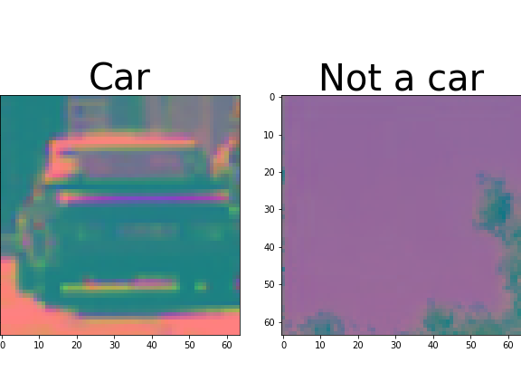
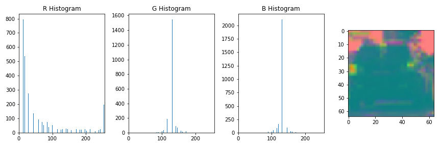
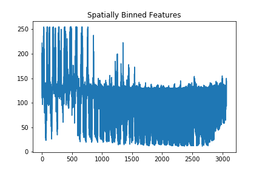
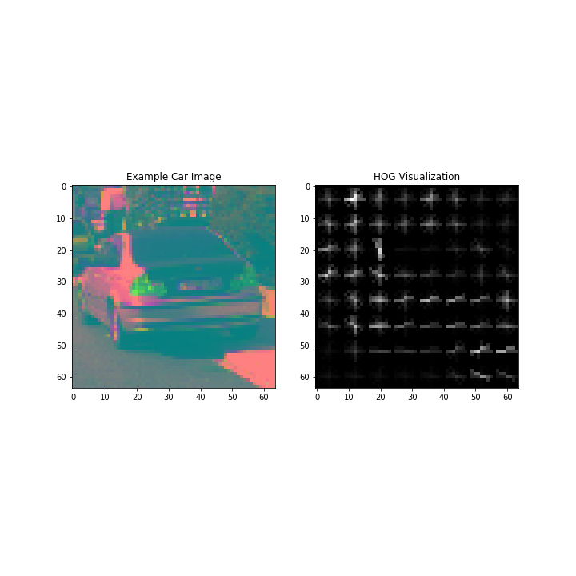
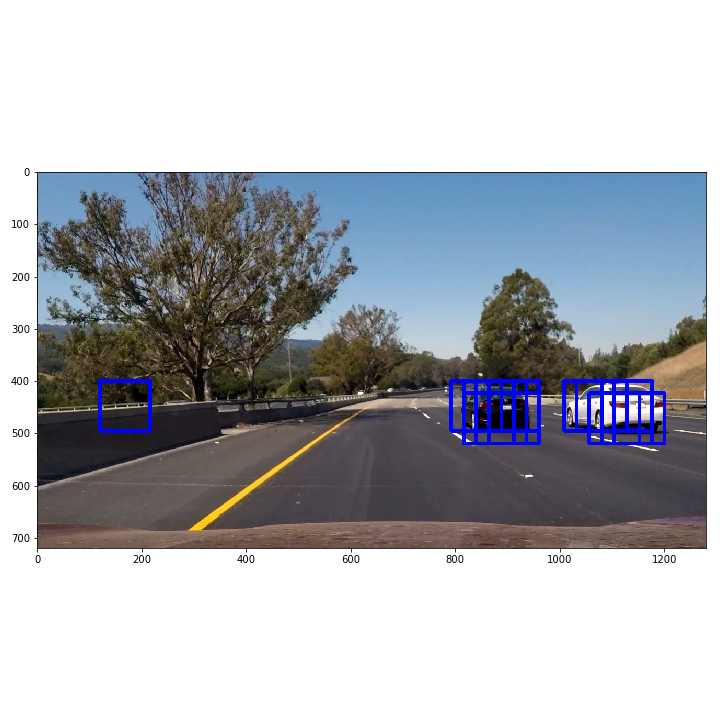
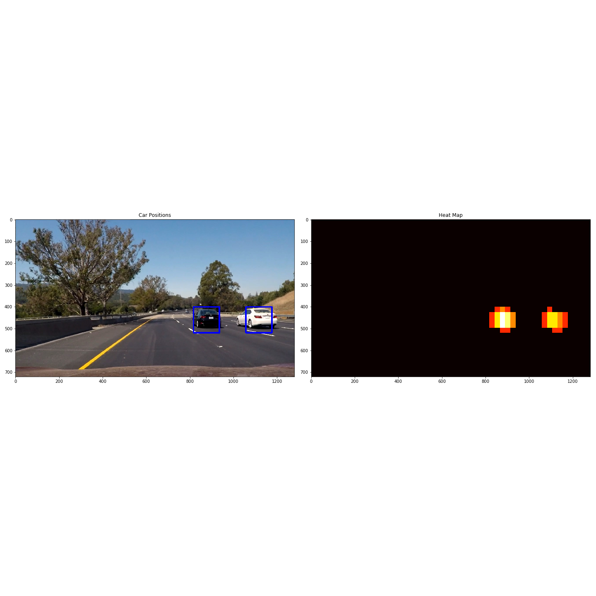

# Vehicle Detection and Tracking
## Galen Ballew, 2017

This repository contains a computer vision and traditional machine learning (i.e. not deep learning) solution to vehicle detection and tracking from dash cam footage in a self driving car. Read a more in-depth article about the project on [Medium](https://medium.com/@galen.ballew).

---
### Training a Classifier

This project uses training images from a combination of the [GTI vehicle image database](http://www.gti.ssr.upm.es/data/Vehicle_database.html) and the [KITTI vision benchmark suite](http://www.cvlibs.net/datasets/kitti/). You can download the data sets for [vehicles](https://s3.amazonaws.com/udacity-sdc/Vehicle_Tracking/vehicles.zip) and [non-vehicles](https://s3.amazonaws.com/udacity-sdc/Vehicle_Tracking/non-vehicles.zip) if you want to reimplement this project.  

Let's see what a sample image looks like:

<figure>

<figcaption>Fig1. - 64x64 image of a car.</figcaption>
</figure>

A convolutional neural network could learn to detect cars like this pretty easily in an image. It does that by breaking an image down into small convolutions which generate edges. These edges ensemble into shapes and so on. Since we are going to use traditional machine learning algorithms, we need to transform this image into a more meaningful feature space. To do this we will use 3 different feature extraction methods, but first let's convert every image to **the YCrCb color space**. *Y* stands for luminance, *Cr* is the red-difference chroma component, and *Cb* is the blue-difference chroma component. YCrCb is excellent for producing a distinction between surfaces with different levels of light and color, especially compared to grayscale where everything can be muddled. This is what it looks like:

<figure>

<figcaption>Fig2. - Training datum in YCrCb.</figcaption>
</figure>

#### Histogram of color
This is exactly what you think! Just tally up the values for each color channel across the X-axis. This is useful thinking about a car, but it can lead to false positives if it's the only feature.

<figure>

<figcaption>Fig3. - A histogram of values from each channel.</figcaption>
</figure>

#### Spatially Binned Colors
Another quick and easy feature vector, spatially binned color takes an image, resizes it to a smaller size, then unravels it row by row into a one-dimensional vector. The image loses resolution and segments of the image with similar X values in the image will have the same pixel value in the feature vector.

<figure>

<figcaption>Fig4. - The position in the vector vs the pixel value.</figcaption>
</figure>

#### Histogram of Oriented Gradients
HOG is a really amazing algorithm. You can read about it [here](http://lear.inrialpes.fr/people/triggs/pubs/Dalal-cvpr05.pdf) or watch a [video](https://www.youtube.com/watch?v=7S5qXET179I) by its creator. In a nutshell, HOG takes an image and breaks it down into a grid. Then, in each cell of the grid, every pixel has its gradient direction and magnitude computed. Those gradients are then but into a histogram with a number of bins for possible directions, however gradients with larger magnitudes contribute more than smaller magnitudes. The cell is then assigned the overall gradient direction and magnitude. This algorithm produces a feature vector that can be thought of like a signature for different objects. This is because the grid format helps to preserve structure - it provides a strong signal while reducing noise. If every gradient direction and magnitude were used as input, the signal would be drowned out.

<figure>

<figcaption>Fig5. - Histogram of Oriented Gradients.</figcaption>
</figure>

What's amazing is that each cell of the HOG looks similar to the edges produced by the low levels of a convolutional neural network! For my project I binned the HOG into **10 directions** and each cell consisted of **8 pixels**. I used the HOG features from **each color channel** as well.

#### Linear SVM
Now that we have a feature vector for image, we can train a classifier on the training data. I used a **LinearSVM** because it's excellent for classification, but it also *very* fast! It's important that the feature vector is normalized/standardized before being passed to the classifier. I ended up with a validation accuracy of **99%** and it only took **3.48** seconds to train the model.

---
### Searching Within a Frame
Next is the task of using the classifier to identify cars within a frame of dash cam footage. I used a **sliding search window** approach for this. I started by removing the top and bottom of the frame, which contain the sky and the hood of the car - we don't need to look for cars there! Next, I took the HOG feature for the ***entire image*** (this part is important!). Then, the image is split into search windows the same size as the input for the model (64x64 pixels) with an adjustable amount of overlap. Then, each search window pulls out the HOG feature information from the array it was stored in for the entire image - this is ***much less expensive*** than trying to do HOG extraction on every search window! Finally, the model predicts on each search window's feature vector.

<figure>

<figcaption>Fig6. - The output from the LinearSVM.</figcaption>
</figure>

---
### Heatmaps
The image above shows multiple detections for each car and a false positive. In order to output a nice, smooth video overlay, we need to track our detections across multiple frames. Heatmaps are an ingenius and simple way to do this. For each frame, there is a matrix of equal size that is filled with zeros. For each bounding box that represents a positive detection, 1 is added to each element inside the box. Thus, areas of the image that are overlapped by multiple detections will produce high values, and false positives will have low values. These areas of high values can then be distinctly separated and a single bounding box can be drawn around them.

<figure>

<figcaption>Fig7. - Heatmaps can track detections across multiple frames.</figcaption>
</figure>

---
### Results
By using heatmaps, we can draw a single detection around areas with multiple detections. We can use this multi-frame approach to process video! Check out my footage from [Chicago](https://www.youtube.com/watch?v=dHlw7db-Ceo) or [California](https://youtu.be/bXg2DQe3Oxo)! These videos use the combined pipeline from my previous project. Check that out in [Part II](https://github.com/galenballew/SDC-Lane-and-Vehicle-Detection-Tracking/tree/master/Part%20II%20-%20Adv%20Lane%20Detection%20and%20Road%20Features) of this repository.

---
### Reflections
This project is mostly a showcase of the power of being explicit. Often times we think of deep learning as a cure-all, but there are situations where explicit computer vision is much better and traditional machine learning is much faster. This project has a very fast backend, but the drawing of bounding boxes, radius, etc (the image editing) is very slow. I can imagine using a pipeline like this to send information to a robotics system in realtime, but not for displaying a HUD to a driver/passenger. Further, this pipeline is not robust enough to handle the driving conditions that it needs to in order to be useable:
  1. Going uphill or downhill
  2. Rain/snow/etc
  3. Poor lighting conditions
  4. Roads that have little or no lane markers
  5. Occlusion by vehicles/signs/etc
